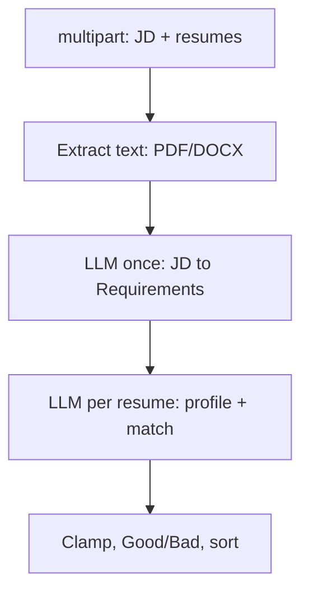

# Implementation plan (KISS, F-first)

Agent conventions: [AGENTS.md](AGENTS.md).

## Principles

- **F-first** — **one LLM parse of the JD** per request; reuse `Requirements` for every resume.
- **Per-resume combined step** — one LLM call per CV returns `CandidateProfile` + match (not separate extract + match).
- **Match from structure + raw** — combined prompt uses `Requirements` + **full JD and full CV text**; where JD section confidence is low, prefer raw text when matching.
- **KISS orchestration** — no judge LLM, no deterministic scorer, no DB; two prompt types: JD extract + screen resume.
- **Field descriptions** — every LLM JSON field documented in prompts and Pydantic (especially years: **IT-relevant** scope).
- **Explain outputs** — each LLM JSON object has **`reasoning`** and **`ambiguities[]` once at object root** (not per section). Sections use **`confidence` only**. Match + JD extract expose reasoning/ambiguities in the API.

> **v1 — Education fields: OR only**  
> Multiple entries in `education.fields[]` mean the candidate may satisfy **any one** field (OR). **AND / dual-major requirements are not supported in v1.** If the JD explicitly requires multiple degrees (e.g. “CS **and** Mathematics”), still extract the fields list, add a note to object-level `ambiguities`, and let the **match** step use **raw JD** for education — do not implement AND logic in code or prompts yet.

## Pipeline (v1)



| Step | LLM calls | Notes |
|------|-----------|--------|
| Validate + parse files | 0 | Non-empty JD; 1–20 files; `.pdf`/`.docx`; 5 MB/file |
| JD → `Requirements` | **1** | Cached in memory for this request |
| Each CV → `ResumeScreeningResult` (profile + match) | **N** (parallel) | One tool call: `submit_resume_screening` |
| Rank | 0 | Threshold 70 |

**Call count:** `1 + N` per batch (was `1 + 2N` with separate extract + match).

**Per-file sequencing:** Each resume gets a single combined screen call (profile extraction + match in one response).

## Structured objects

### Object-level (once per LLM output)

Each **`Requirements`**, **`CandidateProfile`**, and **match result** includes exactly one:

| Field | Type | Purpose |
|-------|------|---------|
| `reasoning` | string | How the model interpreted the document or match (all sections) |
| `ambiguities` | string[] | Unclear points anywhere in that step (empty array if none) |

Do **not** put `reasoning` or `ambiguities` on individual sections.

### Per-section (extract only)

Each section (`role`, `technologies`, …) includes **`confidence`** (0–1) only.

**Low-confidence rule (match prompt):** If a section’s `confidence < CONFIDENCE_THRESHOLD` (default **0.6**), prefer **raw JD/CV** for that section. List which sections are low-confidence in the match prompt (no per-section ambiguity fields).

### Field descriptions (required in prompts & Pydantic)

Every LLM call uses **strict JSON** whose fields must be documented for the model (`jd_extract.md`, `screen_resume.md`, and Pydantic `Field(description=...)` / tool schema).

**Rule:** If a field is easy to misread (e.g. years), the description must state **scope** and **what to exclude**.

#### JD extract — `Requirements`

| Field | Description (include in prompt) |
|-------|----------------------------------|
| `role.title` | Job title as written or best short label. |
| `role.seniority` | `junior` \| `mid` \| `senior` \| `lead` \| `unknown` from title/level wording. |
| `technologies.items[].name` | Technology, language, framework, or tool name. |
| `technologies.items[].min_years` | Minimum years using this tech **in an IT/software role** for this JD; `null` if JD does not state a duration. Not generic employment length. |
| `technologies.items[].priority` | `must` if required; `nice` if optional/preferred. |
| `soft_skills.items[]` | Non-technical behaviors (communication, ownership, etc.). |
| `leadership.tech_lead` | Technical leadership (architecture, mentoring, lead IC) — not HR people management. |
| `leadership.team_lead` | People management (direct reports, hiring, performance reviews). |
| `education.min_level` | Minimum degree level if stated. |
| `education.fields[]` | Acceptable majors/fields; **OR only** (any one satisfies). |
| `education.required` | `true` if degree is mandatory. |
| `experience.min_total_years` | Minimum **IT / relevant professional** years for the role (software, engineering, IT ops as applicable). **Exclude** unrelated jobs (retail, hospitality, etc.) unless JD explicitly counts general experience. `null` if not stated. |
| `reasoning` | One paragraph: overall reading of the JD. |
| `ambiguities[]` | Bullet-level unclear points (empty array if none). |
| Section `confidence` | 0–1 for that section only. |

#### CV extract — `CandidateProfile`

| Field | Description (include in prompt) |
|-------|----------------------------------|
| `identity.name` | Candidate full name from resume header. |
| `technologies.items[].name` | Skill/tech evidenced in CV body. |
| `technologies.items[].years` | Estimated years using this tech **in IT/software roles**. Follow **Prompt constraints → Technology years** below; `null` if not estimable with acceptable confidence. |
| `soft_skills.items[]` | Soft skills with evidence in CV text. |
| `leadership.tech_lead` / `team_lead` | Same semantics as JD. |
| `education.items[].level` / `field` | Each degree or certification level + major/field. |
| `experience.total_years` | Total years in **IT / relevant professional** roles (sum of software/engineering/IT employment). **Exclude** non-IT career time unless clearly tied to the target role. `null` if not inferable. |
| `reasoning` / `ambiguities[]` | Same as JD extract. |

#### Match output

| Field | Description (include in prompt) |
|-------|----------------------------------|
| `matching_skills[].name` | Skill that appears on CV and is relevant to JD. |
| `matching_skills[].years_match` | `clear` \| `not_enough` \| `ambiguous` \| `n/a` — compare JD `min_years` vs CV per-tech years; also consider `min_total_years` vs `total_years` when JD states overall IT experience. |
| `matching_skills[].description` | One short line: match quality for this skill. |
| `not_mentioned_skills[].name` | JD must/nice tech absent from CV (may be omission, not gap). |
| `not_mentioned_skills[].description` | Why it matters; suggest clarification if critical. |
| `match_score` | 0–100 conservative overall fit. |
| `reasoning` / `ambiguities[]` | Overall match narrative; include total IT years comparison when relevant. |

**Implementation:** `backend/app/schemas/field_descriptions.py` (or inline in Pydantic models) — single source of truth; prompt templates inject a **FIELD REFERENCE** appendix generated from the same strings.

### Prompt constraints (must appear in extract & match prompts)

Copy this block (or a shortened version) into `jd_extract.md` and `screen_resume.md` via `{prompt_constraints}`.

#### Evidence & hallucination

- List a technology only if it appears in the **resume or JD text** (skills section, role bullets, project description, stack line). Do not infer from job title alone (e.g. “Java Developer” without Java on CV).
- Do not invent employers, projects, or durations not supported by text.
- If evidence is weak, lower section `confidence` and add object-level `ambiguities[]`.

#### Technology years (CV extract + match) — **critical**

**Goal:** `technologies.items[].years` = time the candidate **actually used** that tech in IT work, not “time at employer” unless the employer tenure clearly equals that tech.

| Situation | Rule |
|-----------|------|
| **Project / engagement described** with dates and stack | Count years for that tech **within that project window** (sum non-overlapping project periods where the tech is named). Prefer this over company-level tenure. |
| **Company-level dates only** (“2019–2023 at Acme”) + tech in a generic stack line for the whole role | Do **not** assume the tech was used for the full company duration unless bullets say so. Use a **conservative fraction** or `null` + ambiguity. |
| **Outsource / outstaff / consulting / agency** (body-shop, SOW, “client: X”, rotating projects) | **Never** equate employment length at the agency with years in a technology. Use **per-project** dates and stated stack only. Flag in `ambiguities` if only agency tenure is visible. |
| **Skills summary** (“Python, Java”) without dates | Do not assign multi-year tenure from the skills list alone; pair with dated experience or set `years` to `null` / low confidence. |
| **Overlapping roles** | Do not double-count calendar time; merge overlapping intervals per tech. |
| **Single short contract** (&lt; 6 months) naming a tech | May count as fractional years or `null`; note in `ambiguities` if JD requires long tenure. |

**Match step:** When setting `years_match`, if CV `technologies[].years` was inferred from **company tenure** at an outsource/outstaff employer while project detail is missing → use `ambiguous` (not `clear`), and say so in `description`.

#### Total IT years (`experience.total_years` / `min_total_years`)

- Sum **dated IT role intervals** (developer, engineer, QA automation, DevOps, etc.); exclude clearly non-IT jobs unless JD asks for general experience.
- **Do not** use “X years at company” when the company is outsource/outstaff and the CV only shows client hopping without clear full-span IT roles — prefer sum of project/role dates; document guess in `ambiguities`.
- Gaps between roles: do not fill gaps with assumed experience; mention gap in `ambiguities` if it affects `min_total_years` comparison.

#### JD extract (`min_years`, `min_total_years`)

- Set `min_years` for a tech only when the JD states a duration (“5+ years Python”) or clear equivalent; else `null`.
- `min_total_years` only when JD states overall experience (“5+ years in software development”); IT-scoped interpretation per field description.

#### Leadership & education

- `tech_lead` / `team_lead`: require behavioral or title evidence; “Lead” in title at outstaff shop ≠ `team_lead` unless direct reports are mentioned.
- Education fields: **OR only**; if JD implies AND, note in `ambiguities` (v1 does not enforce AND).

#### Match scoring conservatism

- `years_match: clear` only when JD requirement and CV evidence align with **same scope** (per-project or clearly full-role stack).
- Prefer `not_enough` or `ambiguous` when outsource/outstaff makes tenure unclear.
- `not_mentioned_skills`: JD tech absent from CV — not proof candidate lacks it (omission vs gap); say so in `description`.

#### When in doubt

- Lower `confidence` for the affected section.
- Add one line to object `ambiguities[]`.
- Match prompt: include that section in **LOW CONFIDENCE SECTIONS** and prefer **raw CV/JD** for the decision.

---

### `Requirements` (from JD — one LLM call)

Built from [prompts/jd_extract.md](backend/app/prompts/jd_extract.md). Used to **compose** the match prompt (not a dump of raw JD alone).

```json
{
  "reasoning": "Senior backend role: Python/FastAPI required 5+/2+ years; Docker nice-to-have; tech lead expected without HR management.",
  "ambiguities": [
    "No explicit people-management requirement despite senior title",
    "Whether related degree fields count beyond CS and Engineering"
  ],
  "role": {
    "title": "Senior Python Engineer",
    "seniority": "senior",
    "confidence": 0.9
  },
  "technologies": {
    "items": [
      { "name": "Python", "min_years": 5, "priority": "must" },
      { "name": "FastAPI", "min_years": 2, "priority": "must" },
      { "name": "Docker", "min_years": null, "priority": "nice" }
    ],
    "confidence": 0.85
  },
  "soft_skills": {
    "items": ["communication", "ownership"],
    "confidence": 0.7
  },
  "leadership": {
    "tech_lead": true,
    "team_lead": false,
    "confidence": 0.8
  },
  "education": {
    "min_level": "bachelor",
    "fields": ["Computer Science", "Engineering"],
    "required": true,
    "confidence": 0.75
  },
  "experience": {
    "min_total_years": 5,
    "confidence": 0.9
  }
}
```

| Section | Fields (+ `confidence` only) |
|---------|--------|
| **role** | `title`, `seniority` (`junior` \| `mid` \| `senior` \| `lead` \| `unknown`) |
| **technologies** | `items[]`: `name`, `min_years` (nullable), `priority` (`must` \| `nice`) |
| **soft_skills** | `items[]`: strings |
| **leadership** | `tech_lead` (bool), `team_lead` (bool) — tech vs people leadership |
| **education** | `min_level`, `fields[]` (**OR only** — any one field may match), `required` (bool) |
| **experience** | `min_total_years` (nullable) — **IT / relevant professional years only** (see field descriptions) |
| **object root** | `reasoning`, `ambiguities[]` (once, not on sections) |

**Extraction rules:** Only extract what is stated or clearly implied in the JD; empty arrays allowed; do not invent technologies.

#### Education `fields` (v1: OR only)

**Semantics:** Every `fields[]` list is treated as **OR** — the candidate meets education if **at least one** field matches a degree/major on the CV (substring match on normalized names). A single field is the degenerate case (one must match).

**JD extract (`jd_extract.md`):**

- Put each acceptable major/field as a separate string in `fields[]`.
- Do **not** emit `fields_operator` or AND logic in v1.
- If the JD says “CS **and** Math”, “dual degree”, “both X and Y”: still list the fields, and add to object-level **`ambiguities`**: e.g. `"JD may require multiple degrees (AND); v1 only checks OR"`.

**Match prompt:**

- Compare `Requirements.education.fields` to `CandidateProfile.education.items` using **OR only**.
- If `education.confidence < CONFIDENCE_THRESHOLD` **or** ambiguities mention AND/dual-degree → prefer **raw JD + raw CV** for the education decision.

**Deferred:** `fields_operator: "and"` and explicit AND matching (v2).

**v1 optional (omit if noisy):** `certifications[]`, `languages[]`, `domains[]` — add when needed, same section + confidence pattern.

---

### `CandidateProfile` (nested in `ResumeScreeningResult.profile`)

Same sections, candidate-side semantics. Produced in [prompts/screen_resume.md](backend/app/prompts/screen_resume.md) (not a separate LLM call).

```json
{
  "reasoning": "Backend engineer ~6 years IT; strong Python/FastAPI; Tech Lead title; BSc CS; Docker not listed.",
  "ambiguities": [
    "IT total years estimated from role dates only",
    "Unclear if people management applied"
  ],
  "identity": {
    "name": "Anu Kumar",
    "confidence": 0.95
  },
  "technologies": {
    "items": [
      { "name": "Python", "years": 6 },
      { "name": "FastAPI", "years": 3 }
    ],
    "confidence": 0.8
  },
  "soft_skills": {
    "items": ["mentoring"],
    "confidence": 0.5
  },
  "leadership": {
    "tech_lead": true,
    "team_lead": false,
    "confidence": 0.7
  },
  "education": {
    "items": [
      { "level": "bachelor", "field": "Computer Science" }
    ],
    "confidence": 0.9
  },
  "experience": {
    "total_years": 6,
    "confidence": 0.75
  }
}
```

| Section | Fields (+ `confidence` only) |
|---------|--------|
| **identity** | `name` |
| **technologies** | `items[]`: `name`, `years` (nullable) — per-skill IT tenure |
| **soft_skills** | `items[]` |
| **leadership** | `tech_lead`, `team_lead` |
| **education** | `items[]`: `level`, `field` |
| **experience** | `total_years` (nullable) — **IT / relevant professional years only** (see field descriptions) |
| **object root** | `reasoning`, `ambiguities[]` (once) |

---

### Screen resume (per resume — one LLM call)

**Prompt:** [prompts/screen_resume.md](backend/app/prompts/screen_resume.md) → tool `submit_resume_screening` → `ResumeScreeningResult`.

**Inputs:**

1. `Requirements` (structured block + JD ambiguities)  
2. Full **raw JD** and **raw CV** text  
3. **Low-confidence requirement section names** (profile confidence is produced in the same call)  

**Output:** `profile` (`CandidateProfile`, internal) + `match` (public API row):

**Match fields** (maps to public API — includes reasoning for recruiters):

```json
{
  "candidate_name": "Anu Kumar",
  "match_score": 85,
  "matching_skills": [
    {
      "name": "Python",
      "years_match": "clear",
      "description": "6 years on CV meets 5+ required"
    },
    {
      "name": "FastAPI",
      "years_match": "clear",
      "description": "Listed in current role; JD requires 2+ years"
    }
  ],
  "not_mentioned_skills": [
    {
      "name": "Docker",
      "description": "JD nice-to-have; not on CV — may be a gap or omitted from resume"
    }
  ],
  "reasoning": "Strong must-have tech match; Docker only a nice-to-have gap; education satisfies OR rule.",
  "ambiguities": [
    "JD leadership scope unclear vs candidate tech-lead title only",
    "Candidate soft skills thinly documented"
  ]
}
```

**No `experience` on match API output** — use `experience.min_total_years` vs `experience.total_years` inside the match LLM (and in `reasoning` / `years_match`), not a duplicate `experience` string on the public candidate row. Per-skill tenure remains in `technologies` + `matching_skills[].years_match`.

#### `matching_skills[]` (objects)

| Field | Type | Values / purpose |
|-------|------|------------------|
| `name` | string | Skill or technology name |
| `years_match` | string | `"clear"` \| `"not_enough"` \| `"ambiguous"` \| `"n/a"` (JD has no min years for this skill) |
| `description` | string | One short line on overall match quality for this skill (aligned with years when applicable) |

Prompt: only include skills **evidenced on the CV** that align with JD must/nice tech requirements.

#### `not_mentioned_skills[]` (objects)

Renamed from `missing_skills` — JD asks for the skill but the CV does **not** mention it; it may be a true gap or simply left off the resume.

| Field | Type | Purpose |
|-------|------|---------|
| `name` | string | Skill required or preferred in JD, absent from CV text |
| `description` | string | Brief note, e.g. not found on CV; clarify with candidate if critical |

Backend: clamp score, set `recommendation`, `source_filename`; ignore any LLM “Good fit” wording. Pass through `reasoning` and `ambiguities` unchanged (trim length cap e.g. 2k / 20 items if needed).

---

## Prompt building (requirements-driven)

**JD extract:** raw JD text + `{prompt_constraints}`.

**Screen resume:** REQUIREMENTS block from parsed `Requirements`, low-confidence requirement section names, JD ambiguities, raw JD + raw CV. Model returns profile + match in one JSON object.

Field semantics live in Pydantic `Field(description=...)` (tool schema). Prompts carry `{prompt_constraints}` only.

---

## Public API

`POST /api/screen` — `job_description` + `resumes[]` (multipart).

```json
{
  "job_title_hint": "Senior Python Engineer",
  "requirements_reasoning": "JD is a senior backend role...",
  "requirements_ambiguities": ["No explicit people-management requirement"],
  "candidates": [
    {
      "candidate_name": "Anu Kumar",
      "match_score": 85,
      "matching_skills": [
        { "name": "Python", "years_match": "clear", "description": "6 years on CV meets 5+ required" },
        { "name": "FastAPI", "years_match": "clear", "description": "Listed in current role" }
      ],
      "not_mentioned_skills": [
        { "name": "Docker", "description": "Nice-to-have; not on CV — gap or omission" }
      ],
      "recommendation": "Good fit",
      "source_filename": "anu_resume.pdf",
      "reasoning": "Strong must-have tech match...",
      "ambiguities": ["JD leadership scope unclear vs candidate tech-lead title only"]
    }
  ],
  "screened_at": "2026-05-20T12:00:00Z",
  "processing_ms": 12340
}
```

- **`requirements_reasoning` / `requirements_ambiguities`** — from `Requirements` object root (once per request).  
- **`candidates[].reasoning` / `ambiguities`** — from match object root (not from extract objects).  
- `CandidateProfile.reasoning` / `ambiguities` stay **internal** (used in match prompt only).  
- Section trees have **confidence** only; no per-section reasoning in API or schemas.

---

## Code layout

| Module | Role |
|--------|------|
| `jd_extract.py` | JD text → `Requirements` |
| `llm_screening.py` | Per resume: `screen_resume` → `ResumeScreeningResult` (profile + match) |
| `ranking.py` | Sort + threshold |
| `models/requirements.py` | Pydantic models + `Field(description=...)` per field descriptions table |
| `schemas/field_descriptions.py` | Shared description strings for prompts (optional single source) |

---

## Phases

1. **Scaffold** — compose, health, frontend shell  
2. **Backend** — parser + 2 prompts + 1+N pipeline + mock LLM + tests  
3. **Frontend** — upload, table, export; show `reasoning` + `ambiguities` per row (expandable)  
4. **Polish** — README, manual E2E  

**Estimate:** ~7–9 days (extra prompt vs bare one-shot).

---

## Testing

- Fixture JD → valid `Requirements` JSON (mock LLM)  
- Fixture CV → valid `ResumeScreeningResult` JSON (profile + match)  
- End-to-end mock: 2 resumes → ranked API shape  
- Manual: real mistral, check low-confidence section uses raw text sensibly  

---

## Deferred (still out of scope)

- Education **AND** / `fields_operator: "and"` (dual-degree must match all fields)  
- Deterministic score from structured diff (formula matcher)  
- Third “judge” LLM  
- Skill alias dictionary / normalization service  
- OCR for scanned PDFs  
- Persisting `Requirements` across HTTP sessions (in-request cache only)  
- Full section trees in API (debug)  

---

## Deliverables

Same as [AGENTS.md](AGENTS.md) checklist.
